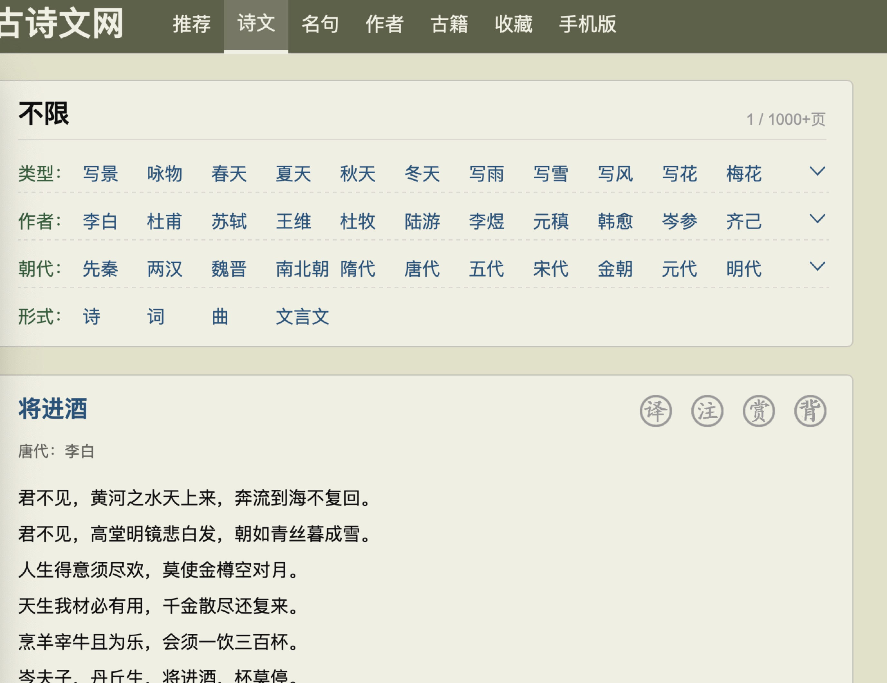
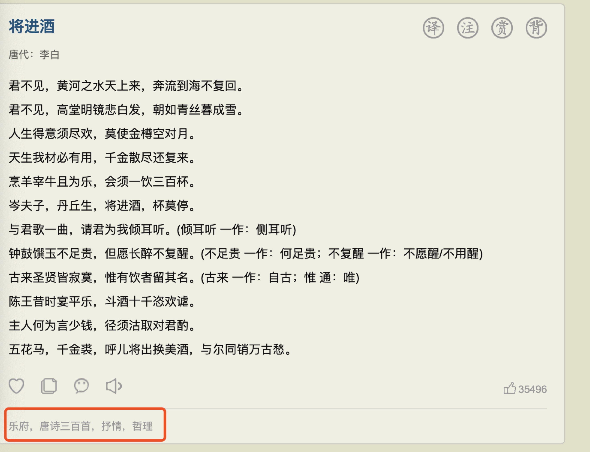

## 下载古代诗词网站的诗歌

链接：https://www.gushiwen.org/shiwen/

## 网站结构

其中每页是10首诗歌，分为诗歌名字；时代；作者和诗歌正文；

页码通过html链接可以直接获得，而整本通过div和class直接获取；

其中红色部分是类型，这里需要说明一下，诗歌只有前五十页的数据有这个字段，51页开始诗歌没有类型说明；

数据一共有1000页，累计下载到本地目录下。

## 其他

1. 无反爬虫或者封号风险(代码中修改AGENT_LIST防止被封)；
2. 数据很规则；
3. 怕取时间10-15分钟；

## python库
import BeautifulSoup
import requests
